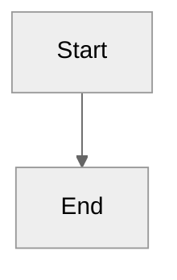
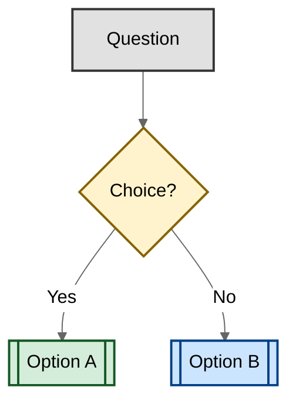

# AGENTS.md

A GitHub Copilot workshop demonstrating AI-assisted coding through a FastAPI-based high school activities management system.

## Commands

```bash
# Install dependencies
pip install -r requirements.txt

# Run the application (development)
uvicorn src.app:app --reload

# Run with VS Code debugger
# Use "Launch Mergington WebApp" configuration from launch.json

# Run tests
pytest

# Run specific test file
pytest tests/test_app.py -v
```

### Pre-commit Validation

**After implementing any change, always run pre-commit validation on changed files.**

```bash
# Identify changed files (staged and unstaged)
git diff --name-only HEAD

# Run pytest on changed test files
pytest $(git diff --name-only HEAD | grep "test_.*\.py$") -v

# Validate Python syntax
python3 -m py_compile $(git diff --name-only HEAD | grep "\.py$")
```

## Project Structure

This is a workshop repository with two main components:

1. **Workshop content** (`.github/steps/*.md`) — Step-by-step learning materials for GitHub Copilot
2. **Sample application** (`src/`) — A simple FastAPI app used as the workshop playground

### Application Architecture

- **Backend**: FastAPI application in `src/app.py` with in-memory data storage
- **Frontend**: Vanilla HTML/CSS/JS in `src/static/` (index.html, styles.css, app.js)
- **Tests**: pytest-based tests in `tests/` directory (added during workshop exercises)

## Code Style

1. **FastAPI route handlers** — Use type hints for all parameters and return types where practical:
   - ✅ `def signup_for_activity(activity_name: str, email: str):`
   - ❌ `def signup_for_activity(activity_name, email):`

2. **Data validation** — Check input validity before mutations:
   - ✅ Validate activity exists, check duplicates, then modify (see `signup_for_activity` in `src/app.py`)
   - ❌ Append without validation

3. **Error responses** — Use FastAPI's `HTTPException` with appropriate status codes:
   - ✅ `raise HTTPException(status_code=404, detail="Activity not found")`
   - ❌ Return plain dictionaries with error messages

4. **Frontend API calls** — Use `fetch()` with proper error handling (see `src/static/app.js`)

5. **In-memory storage** — This is intentional for simplicity; don't add database layers

## Documentation Standards

- Use ATX-style headers (`#` not `===`)
- One sentence per line for easier diffs
- Use relative links for internal references
- Use neutral theme for Mermaid diagrams:

````markdown

````

- Use colors to improve diagram readability (decisions, outcomes, categories):

````markdown

````

## Boundaries

### ✅ Always safe

- Modify `src/app.py` to add features, fix bugs, or improve validation
- Update `src/static/` files to enhance UI/UX
- Add or modify tests in `tests/` directory
- Update `requirements.txt` to add test dependencies (pytest, httpx)
- Improve inline documentation and docstrings

### ⚠️ Ask first

- Adding new dependencies beyond FastAPI/pytest ecosystem
- Changing the data model structure (activity schema, participant format)
- Modifying `.github/workflows/*.yml` files (workshop validation logic)
- Changing `.github/steps/*.md` files (workshop instructional content)
- Altering VS Code configuration in `.vscode/launch.json`

### 🚫 Never

- Replace in-memory storage with a database (intentional simplicity for workshop)
- Remove or disable GitHub Actions workflows (breaks workshop progression)
- Change repository structure (moving `src/` or `.github/steps/`)
- Modify `.devcontainer/` configuration (standardized workshop environment)

## Testing

- **Framework**: pytest with FastAPI TestClient
- **Location**: `tests/` directory (created during workshop Step 4)
- **Run command**: `pytest` or `pytest -v` for verbose output
- **Test structure**: Use `TestClient` from `fastapi.testclient` to test endpoints
- **Coverage expectations**: Tests are added as part of the learning experience, not required from the start

Example test pattern:

```python
from fastapi.testclient import TestClient
from src.app import app

client = TestClient(app)

def test_get_activities():
    response = client.get("/activities")
    assert response.status_code == 200
```

## Workshop Context

This repository serves as a hands-on learning environment for GitHub Copilot.
Students work through progressive steps (in `.github/steps/`) that teach:

1. **Preparing** — Setting up the workspace and understanding the codebase
2. **First introduction** — Using Copilot suggestions, inline chat, and commit message generation
3. **Copilot edits** — [DEPRECATED] This step is no longer active
4. **Copilot agent mode** — Using autonomous agent mode for complex multi-file changes
5. **Copilot on GitHub** — Using Copilot for PR summaries and code review

### Key Workshop Mechanics

- Each step triggers a GitHub Actions workflow when specific criteria are met
- The `accelerate-with-copilot` branch is the primary working branch
- Students use VS Code with GitHub Copilot extension
- Activities are validated through automated checks in workflows

## NOS Culture Alignment

This workshop embodies NOS Culture principles:

- **Customer First**: Simple, clear instructions that communicate transparently
- **We Want More**: Focus on practical results through hands-on exercises
- **We Do What No One Has Done**: Safe experimentation environment for trying AI-assisted coding
- **We Act with Responsibility**: Clear boundaries and structured learning path
- **We Value Our People**: AI (Copilot) as a copilot tool, not a replacement
- **We Build a Better Future**: Efficient learning through practical application

## Additional Guidance

- For detailed workshop instructions, see step files in `.github/steps/`
- For API documentation when running, visit http://localhost:8000/docs (Swagger UI)
- For understanding the learning progression, read steps in numerical order (1-5)
